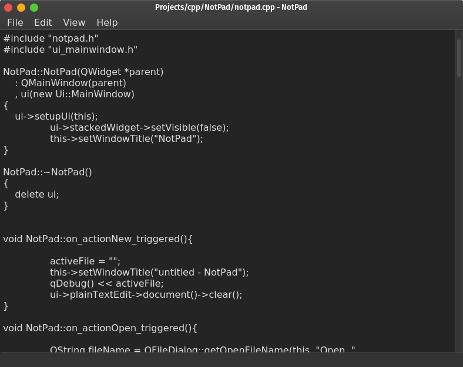

# NotPad
Notpad is a simple plain text editor built using C++ and Qt.

There comes a time where a programmer would want to write his own text editor. Here's mine.

## Build Instructions
### Dependencies
- Qt Libraries version 5.13 and up.
- C++ Compiler

### Instructions
1. Clone the repo using `git clone https://github.com/AJigsawnHalo/NotPad.git` or download and unzip the .zip file.
2. Go to the folder containing the repo in a terminal and run `qmake && make`.
3. Run the program using `./NotPad`.

## License
This project is licensed under the [BSD 2-Clause](https://github.com/AJigsawnHalo/NotPad/blob/master/LICENSE).
This project uses Qt Libraries which is licensed under the [LGPL v3](https://doc.qt.io/qt-5/lgpl.html).
